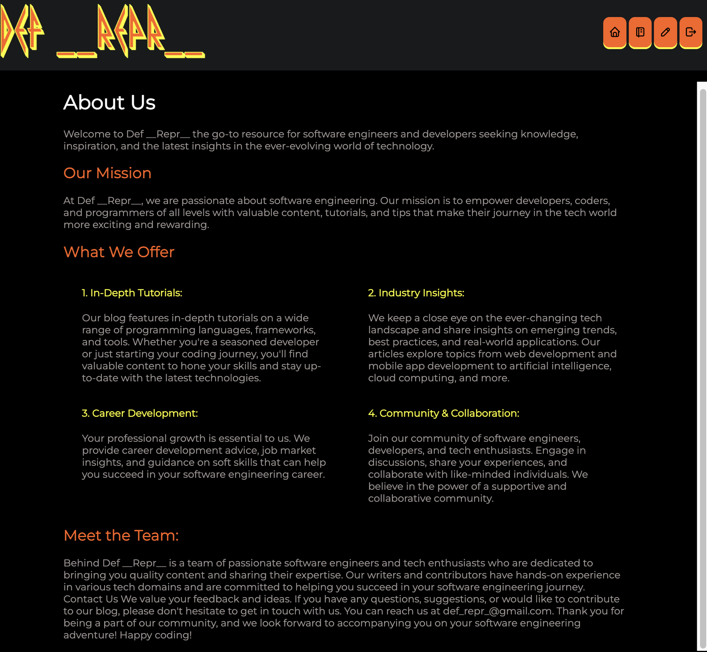
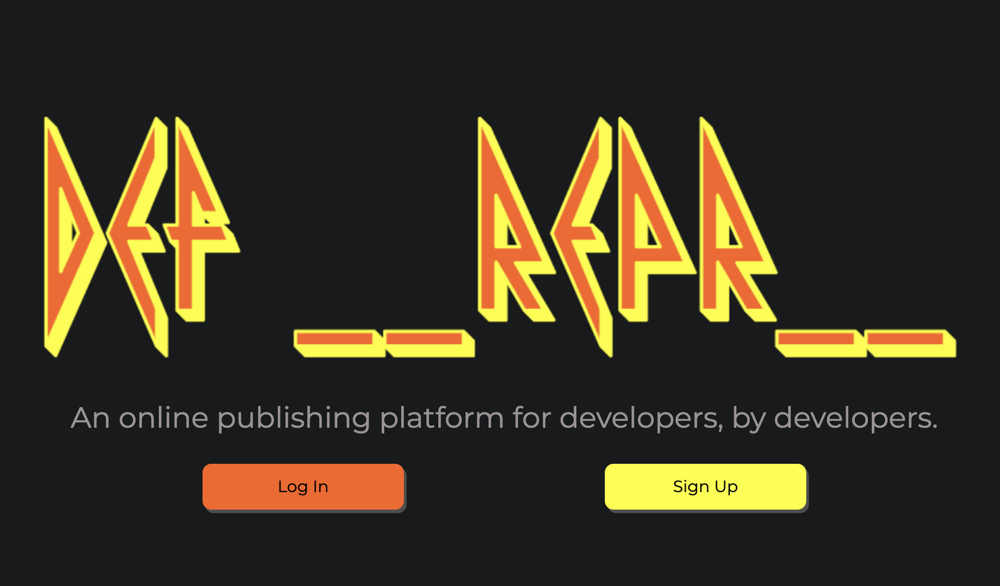
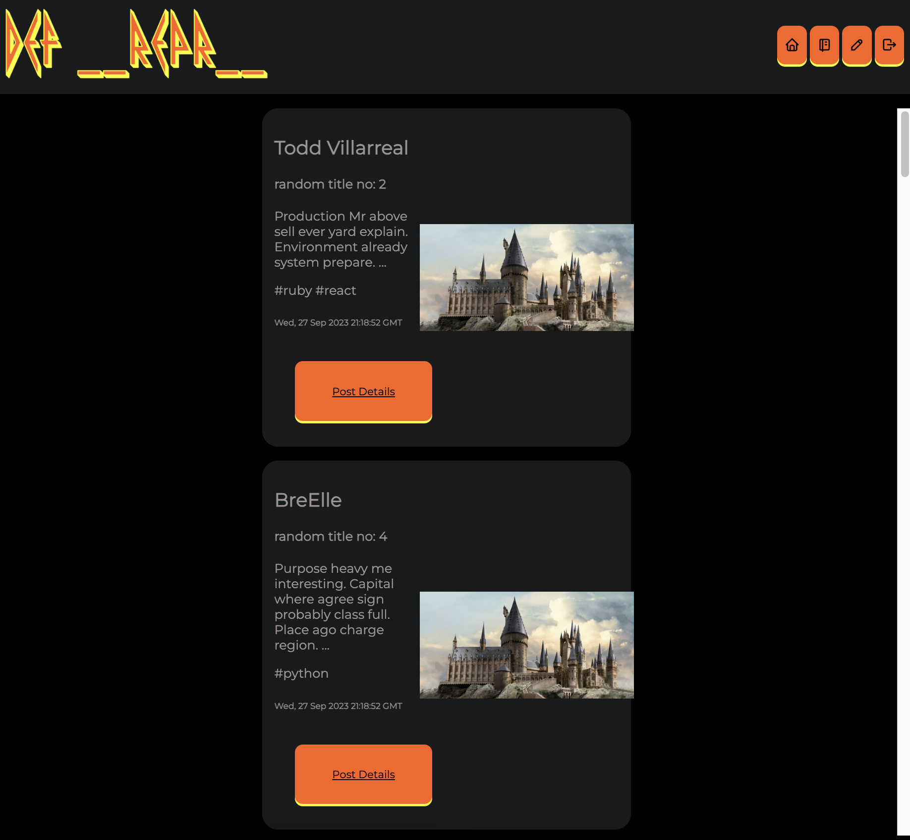
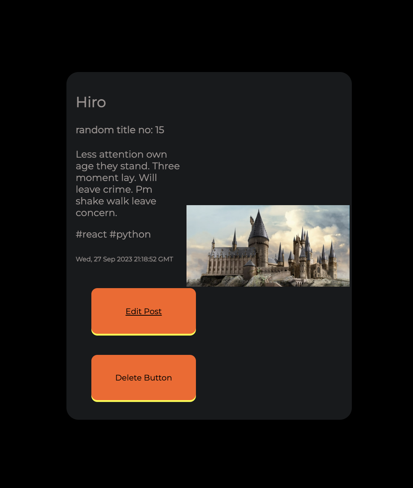

# Def _Repr_

### Professional content and resources for programmers, by programmers

Our mission is to empower developers, coders, and programmers of all levels with valuable content, tutorials, and tips that make their journey in the tech world more exciting and rewarding.

## Getting Started

### Who we are



### Create an account OR Log In



### Cath up on the latest coding news from colleagues



### Edit and Delete your own posts



#### Installation and Instructions

Fork and clone Def Repr to create your own publishing site. Take
a look at the directory structure before we begin (NOTE: node_modules will be
generated in a subsequent step):

```console
$ tree -L 2
$ # the -L argument limits the depth at which we look into the directory structure
.
├── CONTRIBUTING.md
├── LICENSE.md
├── Pipfile
├── README.md
├── client
│   ├── README.md
│   ├── package.json
│   ├── public
│   └── src
└── server
    ├── app.py
    ├── config.py
    ├── models.py
    └── seed.py
```

A `migrations` folder will be added to the `server` directory in a later step.

The `client` folder contains a basic React application, while the `server`
folder contains a basic Flask application. You will adapt both folders to
implement the code for your project .

NOTE: If you did not previously install `tree` in your environment setup, MacOS
users can install this with the command `brew install tree`. WSL and Linux users
can run `sudo apt-get install tree` to download it as well.

## Where Do I Start?

Just as with your Phase 3 Project, this will likely be one of the biggest
projects you've undertaken so far. Your first task should be creating a Git
repository to keep track of your work and roll back any undesired changes.

### Removing Existing Git Configuration

If you're using this template, start off by removing the existing metadata for
Github and Canvas. Run the following command to carry this out:

```console
$ rm -rf .git .canvas
```

The `rm` command removes files from your computer's memory. The `-r` flag tells
the console to remove _recursively_, which allows the command to remove
directories and the files within them. `-f` removes them permanently.

`.git` contains this directory's configuration to track changes and push to
Github (you want to track and push _your own_ changes instead), and `.canvas`
contains the metadata to create a Canvas page from your Git repo. You don't have
the permissions to edit our Canvas course, so it's not worth keeping around.

### Creating Your Own Git Repo

First things first- rename this directory! Once you have an idea for a name,
move one level up with `cd ..` and run
`mv python-p4-project-template <new-directory-name>` to change its name (replace
<new-directory-name> with an appropriate project directory name).

> **Note: If you typed the `mv` command in a terminal within VS Code, you should
> close VS Code then reopen it.**

> **Note: `mv` actually stands for "move", but your computer interprets this
> rename as a move from a directory with the old name to a directory with a new
> name.**

`cd` back into your new directory and run `git init` to create a local git
repository. Add all of your local files to version control with `git add --all`,
then commit them with `git commit -m'initial commit'`. (You can change the
message here- this one is just a common choice.)

Navigate to [GitHub](https://github.com). In the upper-right corner of the page,
click on the "+" dropdown menu, then select "New repository". Enter the name of
your local repo, choose whether you would like it to be public or private, make
sure "Initialize this repository with a README" is unchecked (you already have
one), then click "Create repository".

Head back to the command line and enter
`git remote add origin git@github.com:github-username/new-repository-name.git`.
NOTE: Replace `github-username` with your github username, and
`new-repository-name` with the name of your new repository. This command will
map the remote repository to your local repository. Finally, push your first
commit with `git push -u origin main`.

Your project is now version-controlled locally and online. This will allow you
to create different versions of your project and pick up your work on a
different machine if the need arises.

---

## Setup

### `server/`

The `server/` directory contains all of the backend code.

`app.py` is your Flask application.

The project contains a default `Pipfile` with some basic dependencies. You may
adapt the `Pipfile` if there are additional dependencies you want to add.

To download the dependencies for the backend server, run:

```console
pipenv install
pipenv shell
```

You can run your Flask API on [`localhost:5555`](http://localhost:5555) by
running:

```console
python server/app.py
```

Check that your server serves the default route `http://localhost:5555`. You
should see a web page with the heading "Project Server".

### `client/`

The `client/` directory contains all of your frontend code. The file
`package.json` has been configured with common React application dependencies,
include `react-router-dom`. The file also sets the `proxy` field to forward
requests to `"http://localhost:5555".

To download the dependencies for the frontend client, run:

```console
npm install --prefix client
```

You can run your React app on [`localhost:3000`](http://localhost:3000) by
running:

```sh
npm start --prefix client
```

Check that your the React client displays a default page
`http://localhost:3000`. You should see a web page with the heading "Project
Client".

## Generating Your Database

NOTE: The initial project directory structure does not contain the `instance` or
`migrations` folders. Change into the `server` directory:

```console
cd server
```

Then enter the commands to create the `instance` and `migrations` folders and
the database `app.db` file:

```
flask db init
flask db upgrade head
```

Type `tree -L 2` within the `server` folder to confirm the new directory
structure:

```console
.
├── app.py
├── config.py
├── instance
│   └── app.db
├── migrations
│   ├── README
│   ├── __pycache__
│   ├── alembic.ini
│   ├── env.py
│   ├── script.py.mako
│   └── versions
├── models.py
└── seed.py
```

Edit `models.py` and start creating your models. Import your models as needed in
other modules, i.e. `from models import ...`.

Regularly run
`flask db revision --autogenerate -m'<descriptive message>'`, replacing
`<descriptive message>` with an appropriate message, and `flask db upgrade head`
to track your modifications to the database and create checkpoints in case you
ever need to roll those modifications back.

> **Tip: It's always a good idea to start with an empty revision! This allows
> you to roll all the way back while still holding onto your database. You can
> create this empty revision with `flask db revision -m'Create DB'`.**

If you want to seed your database, now would be a great time to write out your
`seed.py` script and run it to generate some test data. Faker has been included
in the Pipfile if you'd like to use that library.

---

#### `config.py`

When developing a large Python application, you might run into a common issue:
_circular imports_. A circular import occurs when two modules import from one
another, such as `app.py` and `models.py`. When you create a circular import and
attempt to run your app, you'll see the following error:

```console
ImportError: cannot import name
```

If you're going to need an object in multiple modules like `app` or `db`,
creating a _third_ module to instantiate these objects can save you a great deal
of circular grief. Here's a good start to a Flask config file (you may need more
if you intend to include features like authentication and passwords):

```py
# Standard library imports

# Remote library imports
from flask import Flask
from flask_cors import CORS
from flask_migrate import Migrate
from flask_restful import Api
from flask_sqlalchemy import SQLAlchemy
from sqlalchemy import MetaData


```
